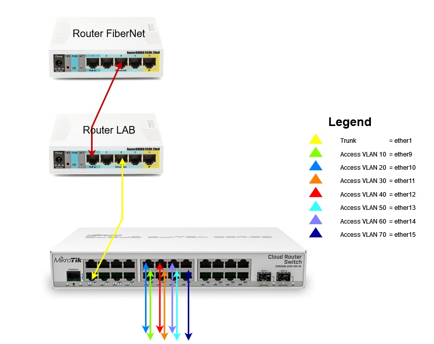
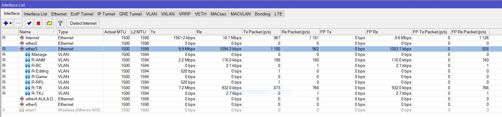
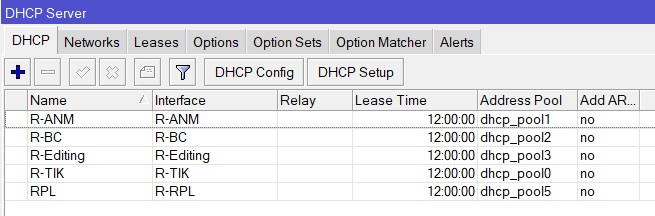

### Topologi
Implementasi menggunakan metode ```Router on a stick```



---
### Address

`172.16.0.0/16 dibagi menjadi 7 network dengan teknik VLSM sebanyak 62 alamat ditiap subnet yang nantinya akan dialokasian ke vlan`

| `Device` | VLAN                  | Address                           | Interface              |
| -------- | --------------------- | --------------------------------- | ---------------------  |
| Switch   | `10`                  | 172.16.0.1/26 - 172.16.0.62/26    |ether9                  |
|          | `20`                  | 172.16.0.65/26 - 172.16.0.62/26   |ether10                 |
|          | `30`                  | 172.16.0.129/26 - 172.16.0.62/26  |ether11                 |
|          | `40`                  | 172.16.0.193/26 - 172.16.0.62/26  |ether12                 |
|          | `50`                  | 172.16.1.1/26 - 172.16.0.62/26    |ether13                 |
|          | `60`                  | 172.16.1.65/26 - 172.16.0.62/26   |ether14                 |
|          | `70`                  | 172.16.1.129/26 - 172.16.0.62/26  |ether15                 |

`Vlan Management dibuat dengan alamat berikut`

| VLAN            | Address                  |
| --------------- | ------------------------------- |
| `99`         | 99.99.99.1/29 - 99.99.99.2/29 |

---
### Interface

Vlan dibuat di ether3


---

### Blocked Policy

Block User yang mengunduh lebih dari 30 Mb

```bash {linenos=true}
/ip firewall filter
add action=passthrough chain=unused-hs-chain comment=\
    "place hotspot rules here" disabled=yes
add action=add-src-to-address-list address-list=client-download \
    address-list-timeout=15m chain=forward comment="Block Download 30MB" \
    connection-bytes=30000000-0 connection-rate=1M-10M disabled=yes protocol=\
    tcp src-address=172.16.0.192/26
add action=add-src-to-address-list address-list=client-download \
    address-list-timeout=15m chain=forward comment="Block Download 30MB" \
    connection-bytes=30000000-0 connection-rate=1M-100M disabled=yes \
    protocol=tcp src-address=172.16.1.0/26
add action=add-src-to-address-list address-list=client-download \
    address-list-timeout=15m chain=forward comment="Block Download 30MB" \
    connection-bytes=30000000-0 connection-rate=1M-100M disabled=yes \
    protocol=tcp src-address=172.16.0.128/26
add action=add-src-to-address-list address-list=client-download \
    address-list-timeout=15m chain=forward comment="Block Download 30MB" \
    connection-bytes=30000000-0 connection-rate=1M-100M disabled=yes \
    protocol=udp src-address=172.16.0.128/26
add action=add-src-to-address-list address-list=client-download \
    address-list-timeout=15m chain=forward comment="Block Download 30MB" \
    connection-bytes=30000000-0 connection-rate=1M-10M disabled=yes protocol=\
    udp src-address=172.16.0.192/26
add action=add-src-to-address-list address-list=client-download \
    address-list-timeout=15m chain=forward comment="Block Download 30MB" \
    connection-bytes=30000000-0 connection-rate=1M-10M disabled=yes protocol=\
    udp src-address=172.16.1.0/26
add action=drop chain=forward comment="Block Download 30MB" disabled=yes \
    protocol=tcp src-address-list=client-download
add action=drop chain=forward comment="Block Download 30MB" disabled=yes \
    protocol=udp src-address-list=client-download
```
---
Blokir Windows Update
```bash {linenos=true}
/ip firewall filter
add action=drop chain=prerouting comment="Blok Windows Update" protocol=tcp \
    tls-host=windowsupdate.microsoft.com
add action=drop chain=prerouting comment="Blok Windows Update" protocol=tcp \
    tls-host=download.microsoft.com
add action=drop chain=prerouting comment="Blok Windows Update" protocol=tcp \
    tls-host=test.stats.update.microsoft.com
add action=drop chain=prerouting comment="Blok Windows Update" protocol=tcp \
    tls-host=ntservicepack.microsoft.com
add action=drop chain=prerouting comment="Blok Windows Update" protocol=tcp \
    tls-host=*.download.windowsupdate.com
add action=drop chain=prerouting comment="Blok Windows Update" protocol=tcp \
    tls-host=*.update.microsoft.com
add action=drop chain=prerouting comment="Blok Windows Update" protocol=tcp \
    tls-host=download.windowsupdate.com
add action=drop chain=prerouting comment="Blok Windows Update" protocol=tcp \
    tls-host=*.windowsupdate.microsoft.com
```
---
Blokir Sosial Media dan Streaming Service (Tidak semua layanan karna keterbatasan cpu)

```bash {linenos=true}
/ip firewall filter
add action=drop chain=forward comment="Tiktok Block" disabled=yes protocol=\
    tcp tls-host=*.musical.ly
add action=drop chain=forward comment="Tiktok Block" content=tiktokv.com \
    disabled=yes
add action=drop chain=forward comment="Tiktok Block" content=musical.ly \
    disabled=yes
add action=drop chain=forward comment="Tiktok Block" content=tiktok disabled=\
    yes
add action=drop chain=forward comment="Twitter Block" content=twitter.com
add action=drop chain=forward comment="Twitter Block" content=.twitter.
add action=drop chain=forward comment="Youtube Block" content=googlevideo.com
add action=drop chain=forward comment="Twitter Block" content=twimg.com
add action=drop chain=forward comment="Telegram Block" content=telegram.com
add action=drop chain=forward comment="Telegram Block" content=.telegram.
add action=drop chain=forward comment="Netflix Block" content=netflix.com
add action=drop chain=forward comment="Netflix Block" content=.netflix.
add action=drop chain=forward comment="Instagram Block" content=instagram.com
add action=drop chain=forward comment="Instagram Block" content=.Instagram.
add action=drop chain=forward comment="Youtube Block" content=youtube.com
add action=drop chain=forward comment="Youtube Block" content=.youtube.
add action=drop chain=forward comment="Youtube Block" content=.googlevideo.
```
---
### DHCP Server

dhcp disetup untuk memudahkan pemberian alamat ip ke komputer dengan lease time 12 jam


---

### Penutup

untuk memaksimalkan jaringan bisa ditambahkan LACP (Link Aggregation Control Protocol) / Bonding, Fail Over, STP, RSTP, dan QOS yang nantinya memaksimalkan pengalaman pengguna.